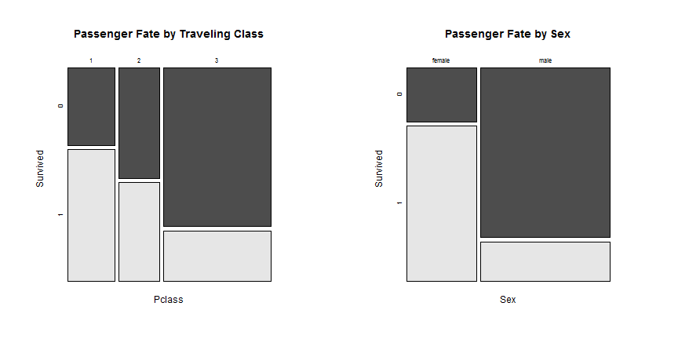

Titanic survived presentation
========================================================
author: Aleksandr Kliushev
date: November 22th, 2015

What is this?
========================================================

This is the simple calculator for predict propability of survived for someone
passanger of Titanic.
You can define 3 parameters:

- Gender
- Age
- Cabin class

How it works?
========================================================
The based of prediction is simple randomforest model, which was made
on [Titanic dataset](https://www.kaggle.com/c/titanic) from Kaggle competition.

The importance of variable:

```
       MeanDecreaseGini
Pclass        36.603993
Mr_l          80.281721
Age           36.058239
Fam_l          6.672724
```
Where:
- Pclass- Cabin class
- Mr_l - dammy variable of gender
- Fam_l - have or not family on a board

Data structure
========================================================

Lets see some mosaic plot:

 

About
========================================================

You can find this application at this [URL](https://aleksklyushev.shinyapps.io/Shiny)
